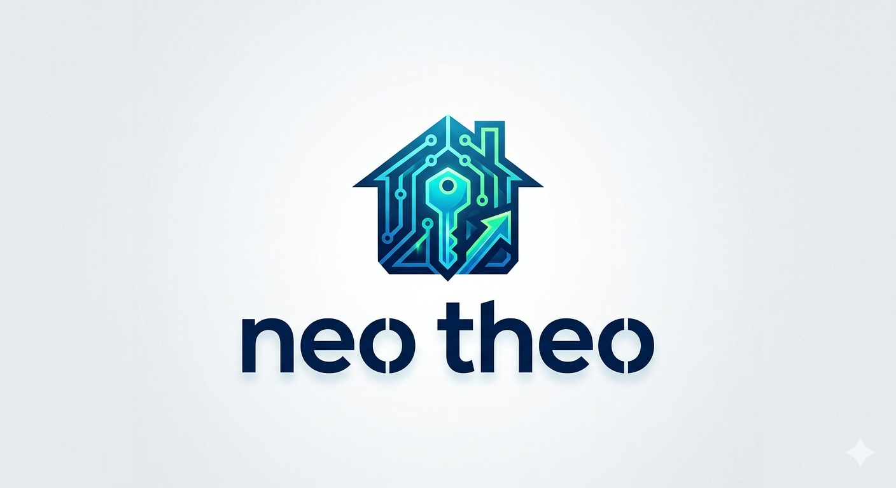
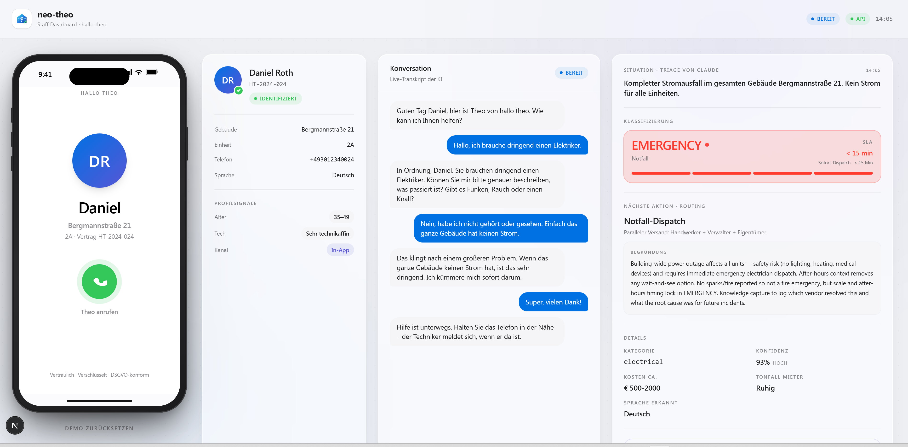
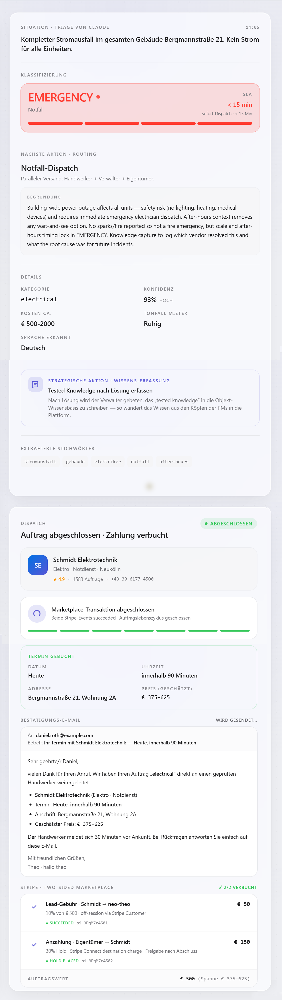
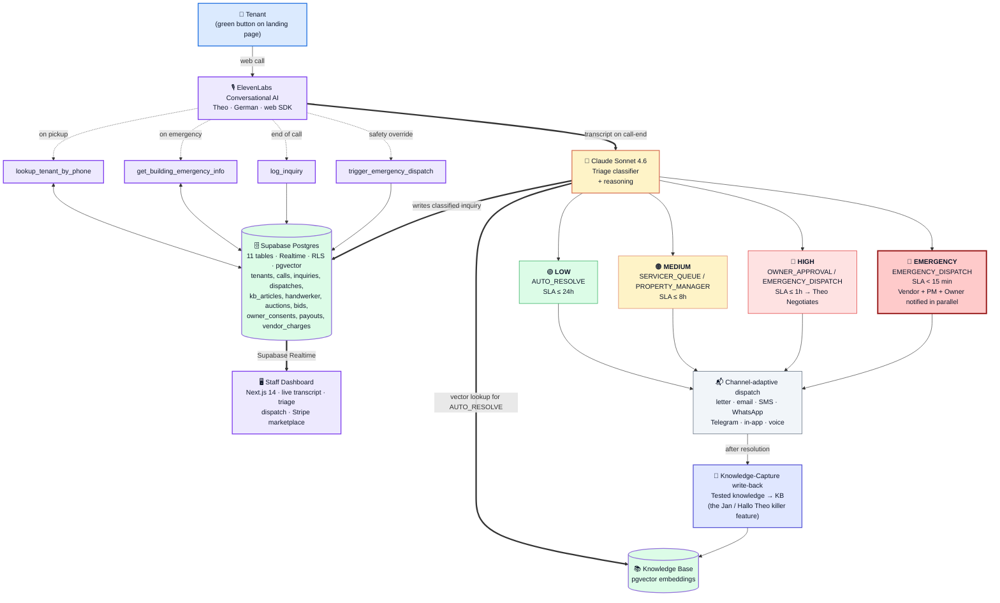
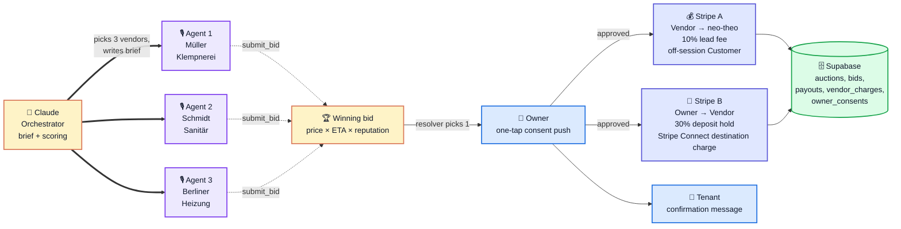
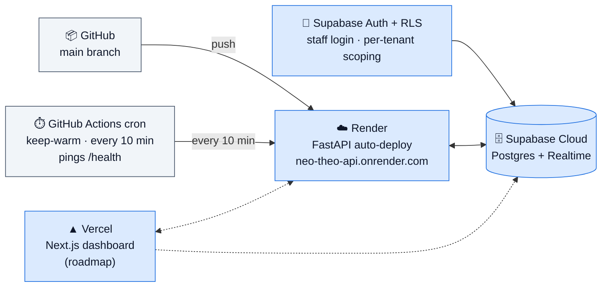

<div align="center">
  

  # **neo-theo**

  ### The future of tenant–property communication

  *Built for the HalloTheo Hackathon · Track 1 · ElevenLabs Integration*

  <br />

  🟢 **Live API** &nbsp;·&nbsp; [`https://neo-theo-api.onrender.com`](https://neo-theo-api.onrender.com) &nbsp;·&nbsp; [`/health`](https://neo-theo-api.onrender.com/health)

   &nbsp;  &nbsp;  &nbsp; 
</div>

---

## 📸 See It Live

<div align="center">
  
  <p><sub><b>Staff dashboard during a live call.</b> Tenant identified by phone on pickup · live German transcript streaming from ElevenLabs · Claude triage on the right classifies <code>EMERGENCY · electrical · 93% confidence</code> with full reasoning · dispatch panel auto-routes to a vetted vendor and surfaces the confirmation email to the tenant.</sub></p>
</div>

<br />

<div align="center">
  
  <p><sub><b>Triage &amp; dispatch column, full detail.</b> Six clearly-zoned sections — Situation · Classification (urgency banner + SLA + 4-step severity bar) · Next Action (routing + owner-approval flag + Claude's reasoning) · Details (category, confidence, cost bucket, tenant tone, detected language) · the strategic Knowledge-Capture flag Jan named as the killer feature · Dispatch with vendor card, appointment, confirmation email, and the two-sided Stripe marketplace transaction.</sub></p>
</div>

---

## 🎯 The Vision

HalloTheo's mandate: build the **futuristic tech solution** — what will be efficient, useful, and actually working **5 years from now**.

**The insight:** *7 out of 10 tenant inquiries don't need real staff involvement.* They're minor issues or things solvable with a step-by-step guide, a YouTube link, or a short article.

**neo-theo** is the AI voice layer that sits between tenants and property staff. It listens, understands, classifies urgency, and routes the inquiry to the right place — automatically.

---

## 👂 Customer Insight (Jan @ Hallo Theo, in person)

We sat with **Jan from Hallo Theo** on hackathon day. The full transcript and extracted insights are in [`docs/JAN_FEEDBACK.md`](./docs/JAN_FEEDBACK.md). The headlines:

- **"Triage and negotiation are two distinct problems."** → Triage is the demo; Theo Negotiates is the Phase-2 framing
- **"Peace of mind"** is the customer-side value — *"I want to know it's being handled, I don't need to chase."* → Our dashboard language reflects this
- **Today: two-tier humans** — generalist Servicer → property-specific Property Manager → owner. Our action-class taxonomy mirrors exactly this structure
- **Tested knowledge** lives in PMs' heads (which elevator vendor fixed which building) → Every staff handoff has a `knowledge_capture` write-back step — *this is the strategic killer feature for Hallo Theo*
- **Customer base spans 25 to 100 years old.** → Channel-adaptive dispatch (letter for the 80-year-old, Telegram for the 25-year-old, same underlying answer)
- **Phone-based identity** → Agent looks up tenant by caller ID on pickup
- **WEG vs SEV** — two distinct business models in German property management; data model accommodates both

See [`docs/CATEGORIES_AND_ACTIONS.md`](./docs/CATEGORIES_AND_ACTIONS.md) for the full triage taxonomy and standard action sequences, and [`docs/INQUIRIES_SAMPLES.md`](./docs/INQUIRIES_SAMPLES.md) for 50 realistic sample inquiries used as our training + eval set.

---

## 🧠 How It Works

1. **Tenant initiates contact** via the hallo theo landing page (green-button web call — per [Wynand's guidance](./docs/WYNAND_FEEDBACK.md), no real telephone number is needed for the demo).
2. **ElevenLabs Conversational AI agent** picks up and has a natural conversation in the tenant's language.
3. The agent **transcribes** every word in real time and posts the final transcript to a **Supabase** webhook at end-of-call.
4. The **AI triage layer** (Claude) classifies the inquiry on **two axes**: urgency (`LOW` / `MEDIUM` / `HIGH` / `EMERGENCY`) and action class (`AUTO_RESOLVE` / `SERVICER_QUEUE` / `PROPERTY_MANAGER` / `OWNER_APPROVAL` / `EMERGENCY_DISPATCH`). Plus a `knowledge_capture_required` modifier flag — see [CATEGORIES_AND_ACTIONS.md](./docs/CATEGORIES_AND_ACTIONS.md).
5. The system **dispatches** via the matching Standard Action Sequence (SAS):
   - 🤖 **AUTO_RESOLVE** → DIY guide via the tenant's preferred channel (letter, email, SMS, WhatsApp, Telegram, in-app — adapted to age + tech profile)
   - 👤 **SERVICER_QUEUE** → ticket to generalist staff (HubSpot-compatible)
   - 🏠 **PROPERTY_MANAGER** → routed to the named PM for that property, with full context + AI-summarized brief
   - 💰 **OWNER_APPROVAL** → owner gets a one-tap consent link (above-budget repairs, structural decisions)
   - 🚨 **EMERGENCY_DISPATCH** → parallel notification to vendor + PM + owner; safety advisory to tenant if applicable
   - 📚 **`KNOWLEDGE_CAPTURE_REQUIRED`** modifier → after staff resolves, **neo-theo** prompts them to write back what they did to the property's knowledge graph (operationalizing Hallo Theo's "tested knowledge" strategic priority)
6. **Everything is logged in Supabase** — full transcript, classification, dispatch action, knowledge captures — indexed by tenant ID / contract number / property ID. The Phase-2 [`Theo Negotiates`](./docs/THEO_NEGOTIATES.md) auction subsystem extends `OWNER_APPROVAL` with multi-vendor voice auctions + two-sided Stripe marketplace.

---

## 📊 By the Numbers — What's Actually Built

> Two days. Two co-builders. One in-person customer conversation with Jan @ Hallo Theo. Everything below is in the repo and verifiable — not roadmap talk.

**Triage engine (live, in the demo)**

- **4 urgency levels** — `LOW` / `MEDIUM` / `HIGH` / `EMERGENCY`, each with an explicit latency budget (24h → <15 min)
- **5 action classes + 1 modifier** — `AUTO_RESOLVE`, `SERVICER_QUEUE`, `PROPERTY_MANAGER`, `OWNER_APPROVAL`, `EMERGENCY_DISPATCH`, plus the `KNOWLEDGE_CAPTURE_REQUIRED` modifier (the strategic feature Jan flagged as "the thing that will make us say yes")
- **7 Standard Action Sequences** (SAS-1 through SAS-7) — deterministic, step-by-step workflows that fire once Claude classifies the call. Each SAS specifies exactly what the system does, in what order, and what SLA applies. See [`docs/CATEGORIES_AND_ACTIONS.md`](./docs/CATEGORIES_AND_ACTIONS.md).
- **15 domain categories** — heating, plumbing, electrical, elevator, locks/keys, appliances, structural, pests, cleaning, noise, document requests, accounting, renovation, information lookup, administrative
- **7 communication channels** — voice callback, letter PDF, email, SMS, WhatsApp Business, Telegram, in-app push — chosen per tenant by age + tech-affinity (Jan's insight #6)

**Agent (ElevenLabs Conversational AI · German)**

- **4 server tools** live in production: `lookup_tenant_by_phone`, `get_building_emergency_info`, `log_inquiry`, `trigger_emergency_dispatch` — all wired to the deployed Render API and called by Claude during the conversation
- **Dynamic per-caller greeting** — agent calls `lookup_tenant_by_phone` on connect and opens with *"Guten Tag {first_name}, hier ist Theo von hallo theo"*, never *"please tell me your name"*
- **5 supported languages** in the data model — German (default), English, Turkish, Polish, Arabic

**Data model & backend**

- **11 database tables** — `tenants`, `calls`, `inquiries`, `dispatches`, `kb_articles`, `handwerker`, `auctions`, `bids`, `owner_consents`, `payouts`, `vendor_charges` — covering the triage flow + the Phase-2 Theo-Negotiates auction subsystem + the two-sided Stripe marketplace
- **686 lines of Python** in `apps/api` (FastAPI + Supabase + Anthropic + ElevenLabs SDKs)
- **1,364 lines of TypeScript/TSX** in `apps/dashboard` — Next.js 14 + Tailwind + shadcn-style components, Supabase Realtime subscription, ElevenLabs web SDK

**Training & eval material**

- **50 hand-written sample inquiries** ([`docs/INQUIRIES_SAMPLES.md`](./docs/INQUIRIES_SAMPLES.md)) — span ages 25 to 100, WEG + SEV, all categories and all SAS branches, each with expected classification — usable as a training set, an eval harness, and a judge demo menu
- **9 documentation files** (~110 KB of design) — architecture, build plan, two customer-feedback transcripts (Jan and Wynand), urgency rules, the categories taxonomy, the Theo Negotiates spec, and ElevenLabs setup
- **1 fully-written knowledge-base article** (`plumbing_slow_drain.md`) demonstrating the `AUTO_RESOLVE` DIY format; the KB schema + retrieval flow is in place for the full corpus

**Production deployment**

- **Backend live** at `https://neo-theo-api.onrender.com` — `/health` returns `{status: ok, db: ok, claude: ok}`
- **Auto-deploy** from GitHub → Render on every push to `main`
- **Cold-start mitigation** — GitHub Actions cron pings `/health` every 10 minutes (`.github/workflows/keep-warm.yml`)
- **CORS hardened** for production deploy (no wildcard + credentials combo)
- **22 commits** across the two-day build, all on `main`

---

## 🏛️ Architecture

The diagram below shows every subsystem actually deployed today, in the order data flows through them. All four urgency lanes are routed through the same triage layer; downstream actions, channels, and the Stripe marketplace are first-class subsystems with their own audit trails.

### 1. Intake → Triage → Dispatch (the main flow)



### 2. Theo Negotiates — HIGH-urgency auction + two-sided Stripe marketplace

When triage emits `HIGH` or `EMERGENCY` with `needs_owner_approval`, neo-theo invokes the auction subsystem. This is a separate flow because it spawns multiple parallel agent sessions and triggers two Stripe operations in one tap.



### 3. Operational layer



For the full schema and the auction subsystem details see [`docs/ARCHITECTURE.md`](./docs/ARCHITECTURE.md) and [`docs/THEO_NEGOTIATES.md`](./docs/THEO_NEGOTIATES.md).

## 🧰 Tech Stack

| Layer | Technology | Why |
|---|---|---|
| **Voice (intake)** | ElevenLabs Conversational AI (web SDK, green-button on landing page) | Natural, multilingual voice agent. Per [mentor guidance](./docs/WYNAND_FEEDBACK.md), web-based call is sufficient for demo — no phone number / Twilio needed. |
| **Voice (negotiator)** | ElevenLabs Conversational AI (3 parallel web sessions simulated in dashboard) | Auction shown as 3 simulated agent panels with live bid extraction. Real outbound telephony is a Phase-2 item (would require Twilio + provisioned number). |
| **AI Triage & Orchestrator** | Claude Sonnet 4.6 (`claude-sonnet-4-6`) | Fast, cheap, smart enough for structured JSON classification + auction brief generation + bid scoring. Swap to Haiku 4.5 (`claude-haiku-4-5`) at scale, or Opus 4.7 (`claude-opus-4-7`) for hard cases. |
| **Backend API** | FastAPI (Python) *or* Node | Async, fast, ElevenLabs webhook-friendly |
| **Database + Auth + Realtime** | **Supabase** (Postgres 15 + pgvector + Realtime + Row-Level Security) | Single platform for triage logs, transcripts, dispatch records, Stripe webhook payloads — chosen on mentor recommendation. Realtime channels drive the dashboard live; RLS scopes tenant data. |
| **Knowledge Base** | Markdown + pgvector embeddings in Supabase | DIY guides, YouTube links, articles, all semantically searchable |
| **Dashboard** | Next.js 14 + Tailwind + shadcn/ui + `@supabase/realtime-js` | Real-time staff view: live transcript stream, auction panels, Stripe events |
| **Notifications** | SendGrid (email DIY guides) | Email dispatch to tenants |
| **Payments** | **Stripe — two-sided marketplace** | (1) Stripe Customer + off-session billing → **neo-theo** charges Handwerker a 10% lead fee on win. (2) Stripe Connect (Custom accounts) → owner pays Handwerker via destination charges with a 30% deposit hold on consent, full release on completion. Both flows fire on a single auction win. |
| **Hosting** | Local (per mentor guidance) — production: Vercel + Supabase Cloud | Local-only for demo. Supabase Cloud takes the DB + Auth + Realtime concerns off the deployment surface. |
| **Auth** | Supabase Auth | Staff login; ships with the DB |

---

## 📁 Repo Structure

```
neo-theo/
├── apps/
│   ├── dashboard/        # Next.js staff dashboard
│   └── api/              # FastAPI backend (webhooks, AI triage, dispatch)
├── packages/
│   ├── agent/            # ElevenLabs agent config + prompts
│   ├── db/               # Schema, migrations, seed data
│   └── knowledge-base/   # DIY guides (markdown) for low-urgency answers
├── docs/
│   ├── ARCHITECTURE.md
│   ├── CATEGORIES_AND_ACTIONS.md  # urgency × action-class taxonomy + SAS sequences
│   ├── INQUIRIES_SAMPLES.md       # 50 sample inquiries spanning all customer profiles
│   ├── BUILD_PLAN.md              # team split + critical path
│   ├── JAN_FEEDBACK.md            # ★ customer (Hallo Theo) feedback session
│   ├── WYNAND_FEEDBACK.md         # technical mentor scope decisions (Twilio out, Supabase in)
│   ├── URGENCY_RULES.md
│   ├── THEO_NEGOTIATES.md         # ★ HIGH-urgency multi-agent vendor auction (Phase 2 framing)
│   └── ELEVENLABS_SETUP.md
└── infra/                # Local dev configs
```

---

## 🎙️ Theo Negotiates — the HIGH-Urgency Auction

When the triage layer classifies an inquiry as `HIGH` (active leak, no heat in winter, gas smell, electrical sparking), **neo-theo** invokes **Theo Negotiates**: a multi-agent voice auction that finds the right vendor in under two minutes — and triggers a **two-sided Stripe marketplace** in one move.

**What happens:**
1. The orchestrator (Claude) picks 3 Handwerker matching the category and writes a German negotiation brief
2. Three ElevenLabs Conversational AI sessions run **in parallel** as live agent panels in the dashboard (no telephony — per [mentor guidance](./docs/WYNAND_FEEDBACK.md), the demo simulates the calls visually rather than placing real outbound calls)
3. Each agent discloses the lead fee up front, negotiates price and earliest slot, then calls `submit_bid(price, slot, confidence)`
4. After all sessions return (or timeout), the resolver scores bids on `price × ETA × reputation` and picks a winner
5. The property owner gets a one-tap consent push: *"Approve Müller Klempnerei, €480, tomorrow 9 AM?"*
6. On approval, **two Stripe operations fire in parallel:**
   - **Vendor → neo-theo:** off-session 10% lead fee charged to the Handwerker's card/SEPA on file (**neo-theo**'s revenue — *"automatic payout for the service"*)
   - **Owner → Vendor (via Connect):** 30% deposit hold on the owner; full amount released on job completion
7. The tenant receives a confirmation message (web agent voice replay or SMS — demo flexible)

**Two-sided marketplace, one win.** The Handwerker pays **neo-theo** for the lead (because we just brought them a qualified, owner-approved job). The owner pays the Handwerker through us (because we keep the deposit on hold until the job is done, which protects them from no-shows). Both flows are auditable in Supabase, both fire in under two minutes.

**Why this lights up all three sponsor tracks:**
- **ElevenLabs** — multi-agent parallel conversational AI in German with structured tool calls
- **Anthropic** — Claude as the orchestrator: vendor selection, brief generation, bid scoring
- **Stripe** — Customer-side off-session billing (lead fee) + Connect Custom destination charges (owner deposit) — a real two-sided marketplace, not a one-flow demo

Full flow, schema additions (`auctions`, `bids`, `owner_consents`, `payouts`, `vendor_charges`), guardrails, and demo script live in [`docs/THEO_NEGOTIATES.md`](./docs/THEO_NEGOTIATES.md).

---

## 🗂️ Customer Data Model

Every call is filed under the tenant's identity. Core entities:

- **Tenant** — `id`, `name`, `contract_nr`, `phone`, `email`, `unit`, `building`
- **Call** — `id`, `tenant_id`, `started_at`, `ended_at`, `audio_url`, `transcript` (full, word-for-word)
- **Inquiry** — `id`, `call_id`, `summary`, `urgency` (LOW/MEDIUM/HIGH), `category` (plumbing, electrical, heating, admin, etc.)
- **Dispatch** — `id`, `inquiry_id`, `action` (`DIY_GUIDE` / `STAFF_QUEUE` / `HANDWERKER` / `AUCTION`), `sent_to`, `sent_at`, `status`

**Theo Negotiates adds** (HIGH-urgency dispatch path):
- **Auction** — `id`, `inquiry_id`, `category`, `brief`, `n_vendors`, `status`, `winning_bid_id`
- **Bid** — `id`, `auction_id`, `handwerker_id`, `price_eur`, `earliest_slot`, `confidence`, `transcript`, `score`
- **OwnerConsent** — `id`, `auction_id`, `bid_id`, `channel`, `message_sent`, `deposit_amount_eur`, `decision`, `responded_at`
- **Payout** *(owner-side)* — `id`, `auction_id`, `bid_id`, `stripe_payment_intent`, `deposit_amount_eur`, `final_amount_eur`, `status`
- **VendorCharge** *(vendor-side)* — `id`, `auction_id`, `bid_id`, `stripe_payment_intent`, `winning_bid_eur`, `fee_pct`, `fee_amount_eur`, `status`

See [`docs/ARCHITECTURE.md`](./docs/ARCHITECTURE.md) for the full schema, and [`docs/THEO_NEGOTIATES.md`](./docs/THEO_NEGOTIATES.md) for the auction subsystem.

---

## ⚡ Quick Start

```bash
# 1. Clone
git clone https://github.com/ibxibx/neo-theo.git
cd neo-theo

# 2. Install
pnpm install        # for dashboard
cd apps/api && pip install -r requirements.txt

# 3. Env
cp .env.example .env
# Fill in: ELEVENLABS_API_KEY, ELEVENLABS_NEGOTIATOR_AGENT_ID,
#          ANTHROPIC_API_KEY, SUPABASE_*, STRIPE_*

# 4. Spin up Supabase locally (or use Supabase Cloud)
npx supabase start                          # local stack (Docker)
npx supabase db push                        # apply packages/db/schema.sql

# 5. Run
cd apps/api && uvicorn main:app --reload    # backend on :8000
cd apps/dashboard && pnpm dev               # dashboard on :3000
```

---

## 🏆 Why This Wins (Hackathon Pitch)

- **Solves a real, measured pain:** 70% of inquiries are over-serviced today
- **Built on tech that will mature, not disappear:** voice AI, RAG, agentic routing
- **Auditable:** every call is logged, searchable, and tied to a tenant
- **Scales:** the DIY knowledge base grows with every resolved call
- **5-year vision:** the agent becomes proactive — predicting issues from past calls, scheduling preventive maintenance, multilingual by default

---

## 👥 Team

Built at the HalloTheo Hackathon in Berlin, 2026, by a two-person team combining property-tech operations, product, and engineering.

### Ian Baumeister — Product, Strategy & Full-Stack Build
[GitHub `@ibxibx`](https://github.com/ibxibx) · [LinkedIn](https://www.linkedin.com/in/avoian/) · Berlin, DE

Founder of [**AvoTravel**](https://avotravel.com) *(part of AVO Group)* — the Business Property Rental Marketplace for the Business Community — and full-stack developer at [ianworks.dev](https://ianworks.dev). Background spans real estate, travel-tech, and marketing operations, with a long track record of building startups at the intersection of physical space and digital product. Builder of **[WorkScanAI](https://github.com/ibxibx/workscanai)** ([workscanai.vercel.app](https://workscanai.vercel.app)) — an AI workflow-analysis platform that scores every human task on a 900-day automation countdown, separates what AI can fully delegate from what requires irreplaceable human judgment, and generates the orchestration blueprint to get there. **A bridge towards AGI:** it makes the invisible map from today's manual work to tomorrow's autonomous agents legible, measurable, and shippable — one task at a time. For **neo-theo**: product vision, system architecture, API + dashboard implementation, hackathon pitch.

### Soheil Fathalian — Technical Co-Lead & Concept Architect
[GitHub `@soheilfathalian`](https://github.com/soheilfathalian) · [LinkedIn](https://www.linkedin.com/in/soheil-fathalian-2000/) · Berlin, DE

Technical Entrepreneur in Residence at **[yoursquares GmbH](https://yoursquares.de)** (PropTech, Berlin), where he works on early-stage technical product development at the intersection of real estate and emerging technology. For **neo-theo**: concept architecture, multi-agent design exploration, vendor-side integration logic (Stripe Connect dispatch, Handwerker negotiation flows), and the longer-term "Property Soul" / synthetic-Verwalter framing that informs the 5-year vision.

> The team's complementary backgrounds — Ian's real-estate-meets-product founding experience and Soheil's PropTech-native technical entrepreneurship — are why **neo-theo** is built on a deep, lived understanding of the actual problem space, not a generic "AI for X" pitch.

---

## 📜 License

MIT — built at the HalloTheo Hackathon, 2026.
